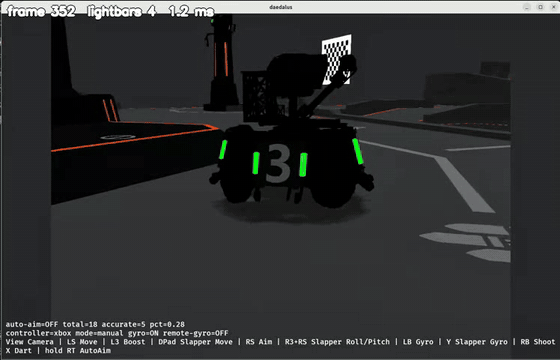
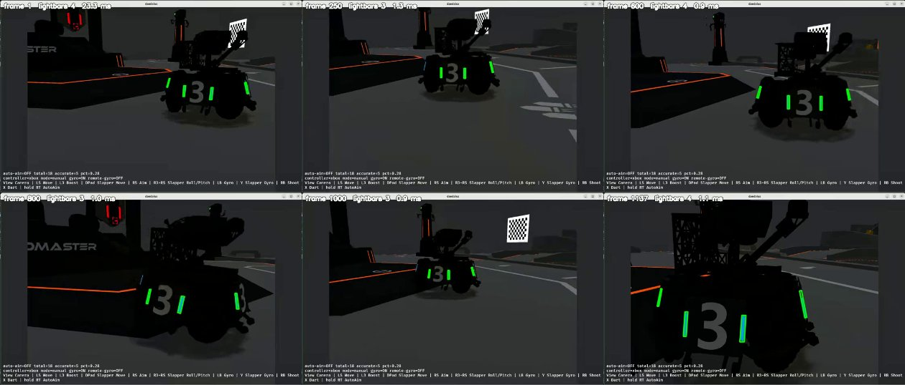
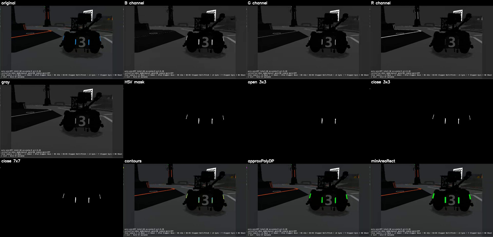
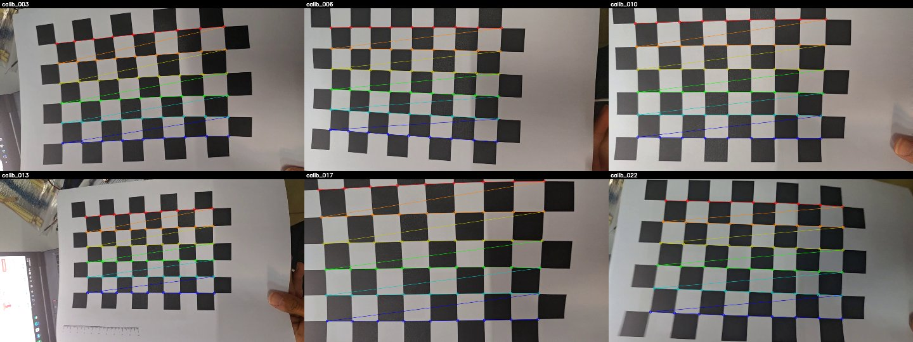
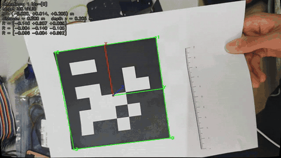
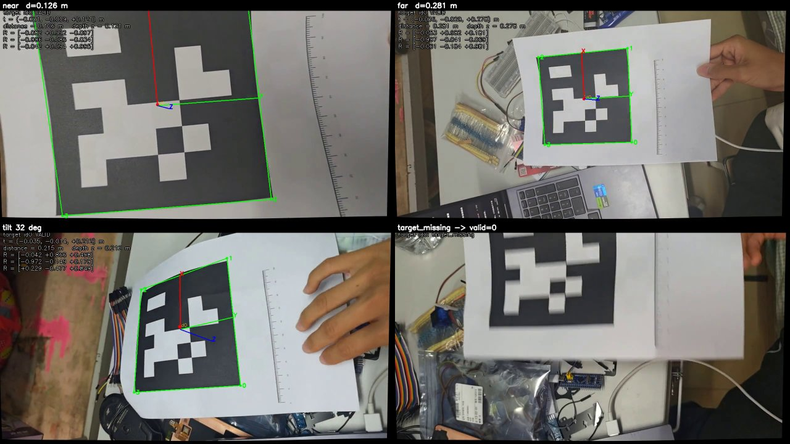
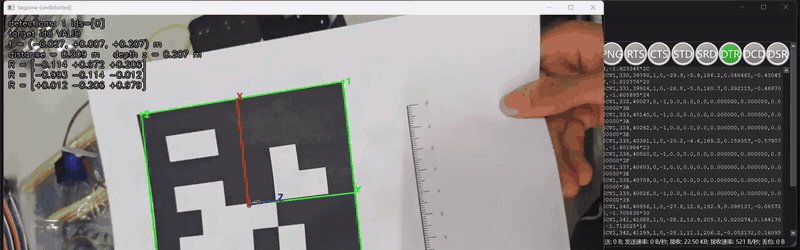
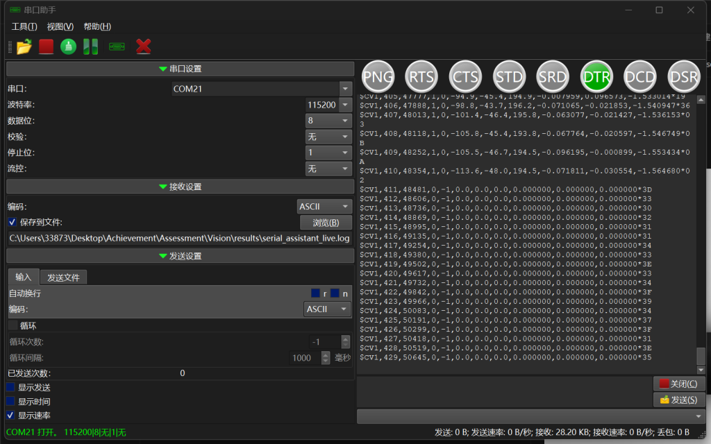

# 视觉组招新考核

Python + OpenCV 实现，三个任务全部完成，并在 Ubuntu 24.04.5（WSL2）上实际运行。仓库：https://github.com/shisisishi/vision-assessment

## 成果一览

| 任务 | 结果 | 完整材料 |
| --- | --- | --- |
| 任务0 环境 | Ubuntu 24.04.5 + Python 3.12.3 + OpenCV 4.14.0 + pupil-apriltags 1.0.4（tag36h11），38 项测试通过 | [版本记录](#任务0环境) |
| 任务一 灯条 | 手册视频 1137 帧逐帧处理；每帧框出 2～5 根蓝色灯条，橙红场地灯被排除；检测约 1.3 ms/帧 | [`results/lightbars/`](results/lightbars/)、[`docs/lightbars.md`](docs/lightbars.md) |
| 任务二 标定 | 自拍 19 张棋盘格（9×6 内角点，方格 20.0 mm），1280×720，重投影误差 2.63 px | [`data/calib/`](data/calib/) |
| 任务二 位姿 | 打印 tag36h11 ID0，黑框实测 100.0 mm；直线距离 0.126～0.281 m，倾斜 32° 仍可检出 | [`results/tagpose_*.mp4`](results/) |
| 任务三 串口 | 任务二实时位姿 → COM20 → SerialPortAssistant（COM21，115200/8N1）；430 帧全部校验正确，覆盖出现 → 消失 → 再出现 | [`results/serial_assistant_live.log`](results/serial_assistant_live.log) |

### 任务一：蓝色装甲板灯条



逐帧标注帧号、灯条数量和检测耗时，按原顺序保存为 [`results/lightbars/lightbars.mp4`](results/lightbars/lightbars.mp4)。下图是整段视频里平移、视角变化和上坡片段的抽帧：



处理流程（第 600 帧）：原图 → B/G/R 通道和灰度 → HSV 掩膜 → 三组形态学对比 → 轮廓 → 多边形近似 → 旋转矩形。HSV 只保留 H 95～130、S≥80、V≥150 的发光蓝色；开运算会吃掉细灯条，最终用 3×3 闭运算加 2×2 膨胀。参数依据和每组对比数字见 [`docs/lightbars.md`](docs/lightbars.md)。



整段检测数量：4 根 779 帧、3 根 290 帧、2 根 59 帧、5 根 9 帧，没有空帧。

### 任务二：相机标定



| 项目 | 数值 |
| --- | --- |
| 相机 | 红米 24122RKC7C 后置摄像头，经 scrcpy 取 1280×720 画面 |
| 棋盘格 | 10×7 方格（9×6 内角点），方格实测 20.0 mm |
| 图片 | 19 张，覆盖不同位置、距离和倾斜方向（[`data/calib/images/`](data/calib/images/)，角点图在 [`data/calib/vis/`](data/calib/vis/)） |
| 内参 K | fx = 825.45，fy = 813.57，cx = 720.50，cy = 403.15（像素） |
| 畸变 | k1 = 0.1455，k2 = −0.2906，p1 = 0.0151，p2 = 0.0079，k3 = 0.1716 |
| 重投影误差 | RMS 2.63 px，单张 1.70～4.13 px |

重投影误差是用标定结果把棋盘格角点投影回图像后，与实际检测角点之间的平均偏差。2.63 px 偏高，原因是打印纸手持拍摄时有弯曲：角点图里最上面一排（红线）明显是弧形。即使对每张图单独做不含镜头模型的平面单应性拟合，残差中位数也有 2.53 px，所以误差主要来自棋盘不平，换角点算法（`findChessboardCornersSB` 为 2.62 px）或剔除最差 3 张（2.31 px）都只能小幅降低。这里保留全部 19 张，没有为压低数字挑图。

### 任务二：AprilTag 位姿



四格依次是最近、最远、倾斜和目标离开画面时的输出。绿色框为指定 ID0 的四个角点（编号 0～3），红点为中心，坐标轴 X 红、Y 绿、Z 蓝；文字是 R、t、直线距离和 Z 深度：



| 演示 | 内容 | 有效帧 |
| --- | --- | --- |
| [`tagpose_live.mp4`](results/tagpose_live.mp4) | 远近、倾斜、整张移出画面再移回，串口演示用的就是这段 | 1142 / 1560 |
| [`tagpose_nearfar.mp4`](results/tagpose_nearfar.mp4) | 直线距离 0.126 → 0.281 m | 798 / 1338 |
| [`tagpose_demo.mp4`](results/tagpose_demo.mp4) | 标签离开画面后又出现 | 515 / 1486 |

逐帧结果（检测到的全部 ID、状态、t、距离、rvec、R、发送的报文）在同名 `.csv` 中。

### 任务三：CV1 模拟串口

左边是 `src.tagpose` 实时检测，右边是 SerialPortAssistant 同步收到的报文；标签移出画面、黑框不完整时变成 `valid=0`，移回后恢复：





接收日志节选（[`results/serial_assistant_live.log`](results/serial_assistant_live.log)，助手「保存到文件」的原始内容）：

```text
$CV1,218,25608,1,0,-81.7,2.7,204.7,-0.089783,0.097350,-1.561320*07   ← 检测到 ID0
$CV1,219,25735,1,0,-81.0,1.1,182.2,-0.052867,0.059702,-1.558424*08
$CV1,220,25874,0,-1,0.0,0.0,0.0,0.000000,0.000000,0.000000*34        ← 标签推出画面上沿，黑框不完整
...
$CV1,229,26932,0,-1,0.0,0.0,0.0,0.000000,0.000000,0.000000*3D
$CV1,230,27072,1,0,-67.1,-24.3,154.4,0.030954,0.040909,-1.529528*37  ← 再次出现
```

- 430 帧，每帧以真实 CR LF 结尾，XOR 校验全部正确，seq 0～429 连续。
- 与程序记录的发送内容（`results/tagpose_live.csv` 的 `serial_line` 列）逐行一致。
- 完整录屏：[`results/serial_assistant_demo.mp4`](results/serial_assistant_demo.mp4)。

---

以下是环境、运行方式、参数和协议的详细说明。

## 目录结构

| 路径 | 职责 |
| --- | --- |
| `src/calibrate.py` | 任务二：棋盘格采集（`capture`）与标定（`calibrate`） |
| `src/tagpose.py` | 任务二：输入读取、去畸变、检测、目标选择、显示/日志；可选接入串口 |
| `src/protocol.py` | 任务三：CV1 报文格式、序号、时间戳、pyserial 发送（与视觉处理分离） |
| `src/serial_pair.py` | 任务三：用 socat 创建 Linux 虚拟串口对；可选的诊断接收器 |
| `src/serial_demo.py` | 任务三：**仅诊断**，发送固定值报文检查链路与校验 |
| `src/print_targets.py` | 生成 AprilTag ID0 与 10x7 棋盘格的打印 SVG |
| `docs/camera.md` | 摄像头、打印实测尺寸（黑框 100.0 mm、方格 20.0 mm）、坐标系示意 |
| `tests/` | `unittest` 单元测试 |
| `tools/setup_ubuntu.sh` | 创建虚拟环境并安装依赖 |
| `output/` | 临时输出（已在 `.gitignore` 中忽略）；需提交的结果放到 `results/` 或 `data/` |

## 任务0：环境

### 版本记录

Ubuntu 24.04.5 LTS 已在 WSL2 里跑过，版本如下。虚拟环境在发行版内的 `/opt/vision-venv`，没有改动桌面上的 Windows `.venv`。

| 项目 | Ubuntu 24.04.5（WSL2，2026-10-07） | 本机 Windows（2026-10-07） |
| --- | --- | --- |
| 系统 | Ubuntu 24.04.5 LTS，内核 6.18.40.1-microsoft-standard-WSL2 | Windows 10.0.26200 |
| Python | 3.12.3 | 3.13.5 |
| OpenCV（opencv-python） | 4.14.0 | 4.14.0 |
| numpy | 2.5.3 | 2.5.3 |
| AprilTag 库：pupil-apriltags | 1.0.4.post11（`tag36h11`，合成图位姿测试已通过） | 1.0.4.post11（`tag36h11`，合成图位姿测试已通过） |
| pyserial | 3.5 | 3.5 |
| socat | 1.8.0.0 | 无（Windows 上没有这条虚拟串口） |
| 串口助手 | 未安装 | SerialPortAssistant 0.5.35 |
| 开发工具 | Cursor | Cursor |

`setup_ubuntu.sh` 结束时会打印上述 Python 库的版本，可直接抄入表格。

### 安装

```bash
sudo apt install python3-venv socat        # 如尚未安装
bash tools/setup_ubuntu.sh                 # 创建 .venv 并 pip install -r requirements.txt
source .venv/bin/activate
```

依赖（`requirements.txt`）：`opencv-python`（4.x）、`numpy`、`pupil-apriltags`、`pyserial`。

AprilTag 使用独立依赖 [pupil-apriltags](https://github.com/pupil-labs/apriltags)，它是 [AprilRobotics/apriltag](https://github.com/AprilRobotics/apriltag)（AprilTag 3 C 库）的 Python 绑定，支持 `families="tag36h11"` 以及 `detect(..., estimate_tag_pose=True, camera_params=(fx, fy, cx, cy), tag_size=...)` 位姿接口。

### 最小验证

```bash
python -c "import cv2; print(cv2.__version__)"
python -c "from pupil_apriltags import Detector; Detector(families='tag36h11'); print('tag36h11 OK')"
python -m unittest discover -s tests -v
```

`src.protocol`、`src.calibrate` 的 `--help` 及协议测试不依赖 pupil-apriltags / pyserial（这两个库在需要时才导入）。

## 任务二：相机标定与 AprilTag 位姿

### 1. 生成打印文件

```bash
python -m src.print_targets --out-dir prints --tag-size-mm 100 --square-mm 20
python -m src.print_targets --verify      # 可选：用 pupil-apriltags 解码生成的图案
```

- `prints/tag36h11_id0_100mm.svg`：tag36h11 ID0，图案取自 OpenCV `DICT_APRILTAG_36h11`。本机测试发现 OpenCV 生成的图案相对官方 `apriltag-imgs/tag36h11/tag36_11_00000.png` 旋转了 180°，程序已转回官方朝向，`tests/test_tagpose.py` 会逐格比对。`100 mm` 指**黑色外框外边长**，四周保留白边（不少于一格）。
- `prints/chessboard_10x7_20mm.svg`：10x7 方格（9x6 内角点），建议 A4 横向打印。
- 两个 SVG 都按毫米写入物理尺寸并附 100 mm 刻度尺。**打印时选择 100% / 实际大小**，打印后用尺子核对刻度尺，再测量黑框外边长和方格边长，记录到 `docs/camera.md`。程序只生成文件，不代表已打印。

### 2. 采集棋盘格

```bash
python -m src.calibrate capture --camera 0 --width 1280 --height 720 --out data/calib/images
```

窗口实时显示角点检测预览；`s` 保存当前**原始帧**（不含叠加标记），`q`/Esc 退出。建议 15～25 张，覆盖画面中部与四边、不同距离和倾斜方向。

### 3. 标定

```bash
python -m src.calibrate calibrate --images data/calib/images --square 0.0200 \
    --output data/calib/camera.json --vis-dir data/calib/vis
```

| 参数 | 含义 |
| --- | --- |
| `--images` | 图片目录或通配符 |
| `--square` | **实测**方格边长，单位米 |
| `--cols/--rows` | 内角点数，默认 9x6 |
| `--vis-dir` | 保存画出角点的图片，用于检查 |
| `--min-images` | 最少有效图片数，默认 8 |

流程：`findChessboardCorners` → `cornerSubPix` 亚像素细化 → `calibrateCamera`。所有图片必须同一分辨率，分辨率不同、无法读取或找不到 9x6 角点的图片会被拒绝并记录原因。

`camera.json` 内容：`image_size`、`camera_matrix`（K）、`dist_coeffs`（k1,k2,p1,p2,k3）、`rms_reprojection_error_px`、`per_image_rms_px`、`accepted`、`rejected`、棋盘格规格和 OpenCV 版本。

重投影误差：用标定得到的 K、畸变和每张图的外参把棋盘格三维角点投影回图像，与检测到的角点比较的像素偏差（RMS）。数值越小说明模型越符合观测；单张误差明显偏大，通常说明该图模糊或角点检测有误，可以删除后重新标定。

### 4. 位姿解算

```bash
# 实时摄像头
python -m src.tagpose --camera 0 --calibration data/calib/camera.json --tag-size 0.1000 \
    --output-video results/tagpose_demo.mp4 --log results/tagpose_log.csv
# 视频 / 图片 / 图片目录
python -m src.tagpose --input some_video.mp4 --calibration data/calib/camera.json \
    --tag-size 0.1000 --headless --max-frames 300
```

| 参数 | 含义 |
| --- | --- |
| `--camera` / `--input` | 二选一：摄像头编号或设备路径；视频、单张图片或图片目录 |
| `--calibration` | `src.calibrate` 生成的 JSON |
| `--tag-size` | **实测**黑色外框外边长，单位米 |
| `--target-id` | 目标 ID，默认 0 |
| `--serial` | 可选，CV1 报文发送端口（任务三） |
| `--output-video` | 可选，保存标注后的视频 |
| `--log` | 可选，逐帧 CSV（检测 ID、状态、t、距离、rvec、R、发送的报文） |
| `--headless` | 不显示窗口 |
| `--max-frames` | 处理帧数上限 |
| `--decimate` | pupil-apriltags `quad_decimate`，默认 2.0：先在降采样 2 倍的图上找四边形，角点再回全分辨率细化。取 1.0 时压缩噪声和倾斜造成的模糊会让黑框边缘断开：`capture4` 每 3 帧取 1 帧共 494 帧，1.0 检出 174 帧，2.0 检出 380 帧；两者都检出的帧位姿差中位数 0.01 mm / 0.03°。只用整数，2.5 这类小数倍一帧都检不出 |

每帧流程：

1. **分辨率检查**：帧尺寸必须与 `image_size` 完全一致，否则报错退出（不缩放、不裁剪）。摄像头打开时会请求标定分辨率。
2. **去畸变**：`initUndistortRectifyMap(K, dist, None, K)` + `remap`，新内参取原 K，因此去畸变图像对应的内参仍是 K。
3. **检测与位姿**：在去畸变灰度图上调用 pupil-apriltags，`camera_params` 取自 K，畸变已去除。
4. **校验**：R 必须有限、正交且 det≈+1，t 有限且 z>0，否则该检测标记为位姿不可用。
5. **目标选择**：保留全部检测结果，再单独从中选出 `--target-id`（同 ID 多个时取 `decision_margin` 最大者）。状态为 `valid` / `target_missing` / `pose_invalid: 原因` / `empty_frame`。
6. **显示**：所有检测画黄色框和 ID；目标画绿色框、角点编号 0–3、红色中心点，以及用目标的 R、t 投影得到的坐标轴（X 红、Y 绿、Z 蓝，长度为半个 tag_size）；文字显示 R、t、距离和 Z 深度。显示的是去畸变后的图像。

### 坐标与单位

- 相机坐标系：X 向右，Y 向下，Z 向前（光轴）。
- Tag 坐标系：沿用 AprilTag 定义，原点在 Tag 中心，X 向右，Y 向下，Z 指向 Tag 内部；示意图与角点顺序见 [`docs/camera.md`](docs/camera.md)。由于 Z 指向 Tag 内部，画面中蓝色 Z 轴指向远离相机的方向。
- `p_camera = R × p_tag + t`，程序内部单位为米。
- `distance = ‖t‖` 是直线距离，`z = t[2]` 是光轴深度，两者分开显示。例：t=(0.10, 0.00, 0.80) m 时，distance≈0.806 m，z=0.80 m。

## 任务三：CV1 模拟串口

### 链路

```text
src.tagpose --serial A ==== socat PTY 对 ==== B ← COMTool / SerialPortAssistant
```

```bash
# 终端 1：创建串口对（保持运行），会打印 A/B 对应的 /dev/pts/N
python -m src.serial_pair create --a /tmp/cv1_a --b /tmp/cv1_b
# 串口助手打开 B（若端口列表中没有，手动填入打印出的 /dev/pts/N），115200 / 8 数据位 / 无校验 / 1 停止位 / 无流控
# 终端 2：先用固定报文检查格式和校验（仅诊断，不是检测结果）
python -m src.serial_demo --port /tmp/cv1_a --mode samples --count 4
# 再接入任务二实时结果
python -m src.tagpose --camera 0 --calibration data/calib/camera.json --tag-size 0.1000 \
    --serial /tmp/cv1_a --log results/tagpose_log.csv
```

本机实际跑的是 Windows 链路：HHD 虚拟串口桥 COM20 ↔ COM21，助手打开 COM21。手机摄像头经 scrcpy 先录成 1280×720 视频，`tagpose` 再逐帧读取、解算并按约 10 Hz 发送，助手同时接收：

```powershell
scrcpy --video-source=camera --camera-id=0 --camera-size=1280x720 --camera-fps=30 --no-audio --record=data/tagpose/capture4.mkv
python -m src.tagpose --input data/tagpose/capture4.mkv --max-frames 1560 --calibration data/calib/camera.json `
    --tag-size 0.1000 --serial COM20 --output-video results/tagpose_live.mp4 --log results/tagpose_live.csv
```

`results/tagpose_live.csv` 的 `serial_line` 列是程序发出的报文，`results/serial_assistant_live.log` 是 SerialPortAssistant「保存到文件」得到的原始接收内容，两者逐行一致。`--max-frames 1560` 去掉了录像结尾约 18 秒的黑屏。

`python -m src.serial_pair listen --port /tmp/cv1_b --log results/rx_check.log` 是可选的诊断接收器，按 CRLF 拆帧并检查校验；它与串口助手不能同时打开 B。**最终接收演示和日志必须来自 COMTool 或 SerialPortAssistant。**

### 报文格式

```text
$CV1,seq,t_ms,valid,id,x_mm,y_mm,z_mm,rx,ry,rz*HH\r\n
```

- 串口：115200/8N1，无硬件/软件流控。
- `seq`：uint32，从 0 开始，每生成一帧加一，`4294967295` 之后回绕到 0。
- `t_ms`：相对程序启动的单调时钟毫秒（`time.monotonic`）。
- `valid=1`：选中目标且位姿通过校验；`id` 为目标 ID。
- `x_mm,y_mm,z_mm`：t（米）×1000，保留 1 位小数。
- `rx,ry,rz`：`cv2.Rodrigues(R)` 得到的旋转向量，弧度，保留 6 位小数；不是欧拉角。
- 定点格式，不使用科学计数法；`-0.0` 统一输出为 `0.0`。
- `HH`：`$` 与 `*` 之间所有字节异或，两位大写十六进制；行尾是真实的 CR LF 两个字节。
- 无效（`valid=0`）：未检测到目标、位姿校验失败、读到空帧，或数值非有限 / z≤0。此时 `id=-1`，坐标和姿态全为 0，每帧都重新判断，不会沿用上一帧的有效位姿。
- 发送频率约 10 Hz（主循环每 0.1 s 发送一次当前帧结果）。
- 发送失败（异常或写入字节数不足）会在 stderr 打印 `[serial] send failed ...` 及累计失败次数；程序自身的打印不代表助手已收到。

已验证的示例（见 `tests/test_protocol.py`）：

```text
$CV1,42,12345,1,0,100.0,-50.0,800.0,0.000000,0.000000,0.000000*33
$CV1,43,12445,0,-1,0.0,0.0,0.0,0.000000,0.000000,0.000000*09
```

## 测试

```bash
python -m unittest discover -s tests -v
```

- `test_protocol.py`：手册两条示例（`*33`、`*09`）逐字节一致、真实 CRLF、NaN/Inf/z≤0/缺失目标转为无效帧、定点格式、uint32 回绕、解析与校验错误。
- `test_tagpose.py`：位姿校验（反射、非正交、NaN、z≤0）、目标选择、距离与深度区分、坐标轴投影、角点顺序、标定文件与分辨率检查、打印图案与官方 ID0 一致；装有 pupil-apriltags 时还会用合成图像检查已知位姿能否被正确恢复。

2026-10-07 在本机 Windows 上 `python -m unittest discover -s tests -v` 为 38 项全部通过，其中包括 pupil-apriltags 的合成位姿恢复。同日在 Ubuntu 24.04.5 上用 `/opt/vision-venv/bin/python -m unittest discover -s tests -v` 再跑一遍，同样 38 项全部通过。

2026-10-08 改为 `--decimate 2.0` 后两边各重跑一次，仍是 38 项全部通过。

## 手册要求的提交材料

| 手册要求 | 文件 |
| --- | --- |
| 源码、依赖配置、README | `src/`、`config/lightbars.json`、`requirements.txt`、`tools/setup_ubuntu.sh`、本文件 |
| 灯条结果视频与对比图 | `results/lightbars/lightbars.mp4`；`results/lightbars/frame_XXXX/`（通道、掩膜、形态学、轮廓、多边形、最终框）；`results/lightbars/verification.json` |
| AprilTag 打印尺寸 | `prints/tag36h11_id0_100mm.svg`、`prints/chessboard_10x7_20mm.svg`；实测记录在 `docs/camera.md` |
| 标定图片与参数文件 | `data/calib/images/`（19 张原图）、`data/calib/vis/`（角点图）、`data/calib/camera.json` |
| 位姿演示 | `results/tagpose_live.mp4`、`results/tagpose_nearfar.mp4`、`results/tagpose_demo.mp4` 及同名 `.csv` |
| 串口接收演示与日志 | `results/serial_assistant_demo.mp4`、`results/serial_assistant_live.log` |

## 已知问题

- 任务一已用手册视频验证，说明见 `docs/lightbars.md`。原片在 `C:\Users\33873\Downloads\test_video2..mov`，来自手册百度网盘（提取码 `xik2`），仓库内不重复存放。
- 打印尺寸已确认为黑框 100.0 mm、方格 20.0 mm。位姿演示使用红米后置摄像头经 scrcpy 的 1280×720 画面。手机自带相机录的 720×1280 竖屏视频不能套用这份标定。原始采集视频留在本机 `data/calib/capture.mp4`、`data/tagpose/capture*.mp4` 与 `data/tagpose/capture4.mkv`，不放入远程仓库。
- 标签整体移出画面、黑框被画面边缘切掉或贴着画面边缘外面没有白边时检测不到，这是 AprilTag 需要完整黑框和外圈白边才能解码决定的。`detect` 会在去畸变图外补 80 像素白边，只能救黑框正好贴边的情况。`results/cv1_from_nearfar.txt` 与 `tools/send_cv1.sh` 是早期用录好的报文重放、检查助手链路的工具，最终接收日志以实时运行的 `serial_assistant_live.log` 为准。
- SerialPortAssistant 0.5.35 已安装。COM3–COM6 是蓝牙串口。com0com 3.0 在安全启动下驱动错误码 52，没有可用端口。本机改用带签名的用户态虚拟串口，桥为 COM20 ↔ COM21。助手打开 COM21，发送端写 COM20。
- Ubuntu 24.04.5 装在 `D:\WSL\Ubuntu-24.04`，名称 `Ubuntu-24.04`。启动：`wsl -d Ubuntu-24.04`。依赖在 `/opt/vision-venv`。商店下载「适用于 Linux 的 Windows 子系统 3.0.1」曾停在 87.1%，当时本机 `wsl --version` 已是 3.0.1.0，发行版是从清华镜像的 `ubuntu-24.04.5-wsl-amd64.wsl` 本地安装的。
- 部分摄像头不支持请求的分辨率，此时程序会因分辨率不一致报错，需要按实际分辨率重新采集和标定。
- 部分串口助手只列出 `/dev/ttyS*`、`/dev/ttyUSB*`，可能需要手动填写 `/dev/pts/N`；WSL 下需确认端口确实可见。
- 去畸变图像沿用原 K（未调用 `getOptimalNewCameraMatrix`），边缘可能有少量黑边或被裁掉的视野。
- 标定误差 2.63 px 偏高，主要来自手持打印纸的弯曲（分析见上文「任务二：相机标定」）。贴在硬板上重拍可以进一步降低。
- Windows 上的 scrcpy 不能把手机画面当成摄像头给 OpenCV 直接读取，所以位姿和串口演示是先用 scrcpy 录下 1280×720 视频，再由 `src.tagpose` 逐帧读取、解算并实时发送。接 USB 摄像头时直接用 `--camera 0`，处理流程不变。
- 角点重投影误差（CSV `corner_reproj_px`）只是诊断量，不用于判定位姿是否有效。
- 发送节拍取决于主循环速度；相机读取阻塞时无法保证 10 Hz（手册不考核此项）。
- 若 pupil-apriltags 的预编译包与所装 numpy 版本不兼容，需要降低 numpy 版本。

## 参考来源

- 考核手册：视觉组招新考核手册（北京，26.9）
- AprilTag 3 C 库与位姿说明：<https://github.com/AprilRobotics/apriltag>（README「Pose Estimation」、`apriltag_pose.c`、`tag36h11.c`）
- 官方 Tag 图像：<https://github.com/AprilRobotics/apriltag-imgs>
- pupil-apriltags：<https://github.com/pupil-labs/apriltags>
- OpenCV 相机标定教程：<https://docs.opencv.org/4.x/dc/dbb/tutorial_py_calibration.html>
- OpenCV ArUco / AprilTag 字典：<https://docs.opencv.org/4.x/d5/dae/tutorial_aruco_detection.html>
- pyserial：<https://pyserial.readthedocs.io/>
- socat：<http://www.dest-unreach.org/socat/>
- SerialPortAssistant：<https://github.com/KangLin/SerialPortAssistant>；COMTool：<https://github.com/Neutree/COMTool>
